# Introduction
- Most Okta - HR system connections are similar
- From what I've seen in the wild, HR <-> Okta <-> Active Directory integrations might look something like this
	- User is created in HR system. User is then provisioned to Okta down to Active Directory. 
	- OR, a user is created in Active Directory and flows upwards through Okta to your HR system. 
	- In most cases usually either Active Directory or the HR system is the source of truth for user attributes. Sometimes there are exceptions. 
	- Sometimes users can update their email address in Active Directory or Okta, but then have the HR system be the source of truth for other user attributes like Department.

# Lab Scenario
- In this scenario:
	- Your organization is moving from an on-premise, home-grown HR management system to BambooHR - a cloud-based HR management system. You're moving to BambooHR because...
		- The home-grown HR management system is poorly written, difficult to use and difficult to maintain. 
		- There is a push within your organization to move away from maintaining on-premise servers to moving into the cloud.
		- Your organization has recently started to use Okta to enable multi-factor authentication for your applications, and the home-grown HR management system is not easily integrated with Okta via SSO. 
	- **Note**: If you don't feel like working with BambooHR or just need to simulate an HR system, a CSV directory works just fine too. 
	- There are existing users in Active Directory that have already been migrated to BambooHR from the legacy system, but their accounts have not been linked through Okta yet. 
	- BambooHR is going to be the "source of truth" for most attributes except email address.
	- Default email addresses are in the format `firstName.lastName@youremaildomain.com` but users have the option of changing their email address via Active Directory to a vanity email address like `nickname@youremaildomain.com`.
	- New users that are created in BambooHR must be provisioned down to Active Directory using Okta.

# User Data Information
## User Data Flow Diagram
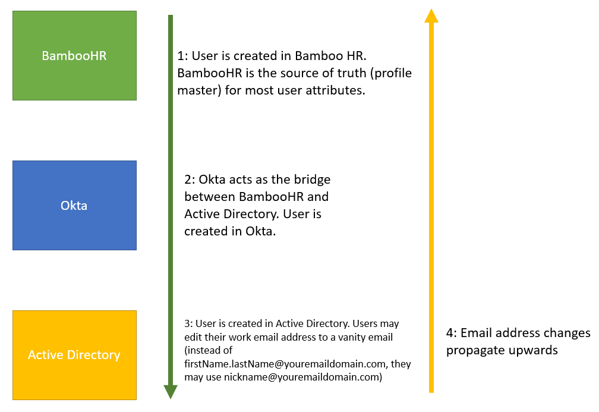

## Test User Data
- If you need functioning email addresses, you can change the email address fields. If you need working email address for development check out [[1 - Ways to create working email addresses for your users]].

| firstName | lastName | department             | title                | email                             | In Active Directory? | In BambooHR? |
|-----------|----------|------------------------|----------------------|-----------------------------------|----------------------|--------------|
| Kennedy   | Smith    | Information Technology | Helpdesk             | kennedy.smith@youremaildomain.com | Yes                  | Yes          |
| Rosario   | Evans    | Sales                  | Sales Engineer       | rosario.evans@youremaildomain.com | Yes                  | Yes          |
| Leon      | Raymo    | Information Technology | Full Stack Developer | leon.raymo@youremaildomain.com    | No                   | No           |

# Relevant Documentation
- [Okta Active Directory Integration](https://help.okta.com/en-us/content/topics/directory/ad-agent-main.htm)
- [Okta and BambooHR integration](https://help.okta.com/en-us/content/topics/provisioning/bamboohr/bamboohr-main.htm)

# Okta Initial Setup
## Getting an Okta Tenant for labs
- If you work for an Okta Partner, you can create on-demand demo okta tenants via demo.okta.com.
- If you do not work for an Okta Partner, you can do one of two things to get your own Okta sandbox tenant:
	- Sign up for a free trial [here](https://www.okta.com/free-trial/)
	- Sign up for an Okta Developer tenant (though some of the features in a developer tenant vary slightly from a demo or trial tenant) [here](https://developer.okta.com/)
- Note that "Sandbox" is not the proper Okta terminology for a dev-level Okta tenant. 
	- For your organization, you most likely have a **preview** and a **production** environment. 

## Okta AD Service Account
- Though this is a development environment and you COULD just use your default Super Administrator account, Okta suggests you create a separate service account just for the Active Directory integration.
	- Generally, you create non-human owned service accounts for system to system interactions. Why?
		- Human-owned accounts are more likely to change permissions.
		- If an employee gets terminated from an organization, so too, does their account, breaking any system connections that were reliant on their account. 
- Let's create a separate service account here. 

# Active Directory Initial Setup
- You can use either a local virtual machine with internet access OR create an Amazon EC2 instance
	- Both of these tasks are straightforward and won't be covered here

1. To have the agent install work smoothly, you can either open the Server Manager and turn OFF the Internet Explorer Enhanced Security configuration or you can add okta.com to Internet Explorer's trusted sites.
	1. If you turn off the IE Enhanced Security configuration, install Chrome so you can access the Okta dashboard from there. 
	2. To turn off the IE Enhanced Security Configuration go to Configure This Local Server and find the option to turn it off.
2. In the Server Manager, go to Manage > Add Roles and Features
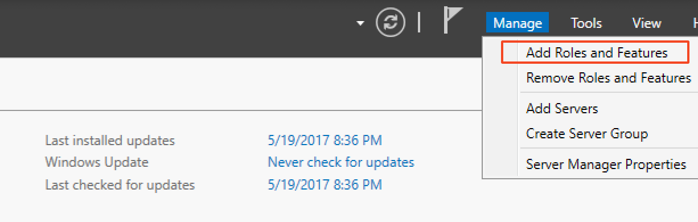
3. On the wizard, click "Next" and do a Role-Based Installation.
4. Click "Next" until you get to the possible roles you can install. 
5. Select "Active Directory Domain Services" as the role to install.
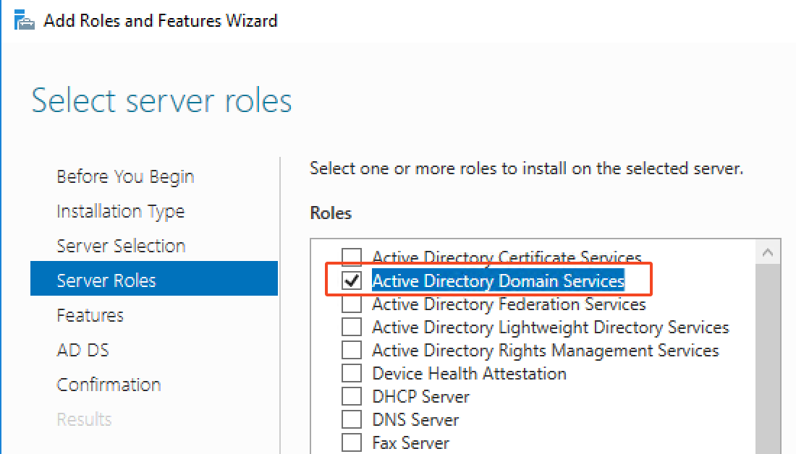
6. Go through the installation wizard until the Active Directory install is complete. 
7. Promote the server to a domain controller via the flag icon in the upper left corner of the screen.
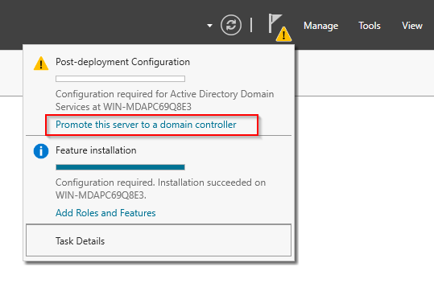
8. Select the "Add a new forest" checkbox and enter your desired domain. It doesn't have to be functional. Click "Next"
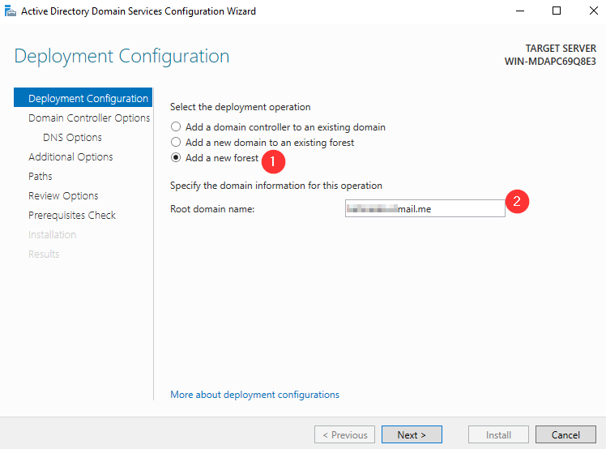
9. On the next screen, the DSRM password doesn't come into play here, but it may help to remember it for the future. Set it to anything you wish. 
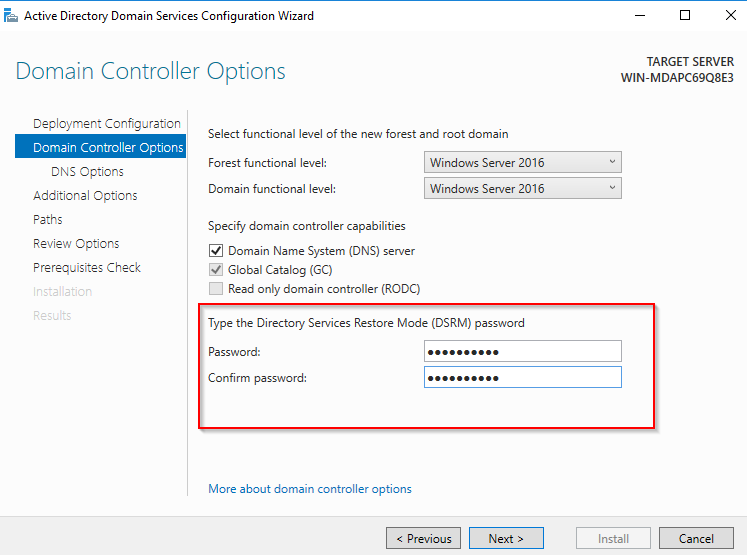
10. Go through the rest of the wizard until the promotion to domain controller is complete. You can keep any default values. The server may restart automatically.
11. Create the users in Active Directory. Refer to the table at the beginning of this tutorial for user data. In the Server Manager go to Tools > Active Directory Users and Computers.

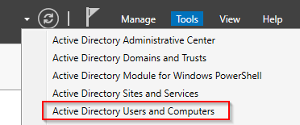
12. Expand your domain. Right-click and go to New > Organizational Unit. Create a new OU and name it "employees"
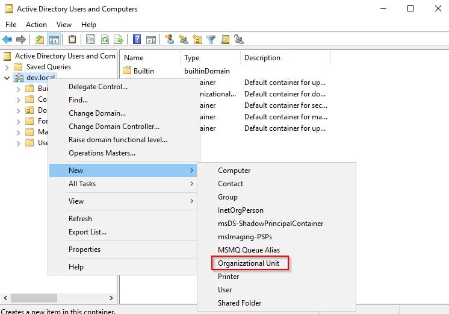
13. Right click the new "employees" OU. Enter the values based on the table provided earlier in the tutorial. Do this for both Kennedy and Rosario. When you enter a password, check the "Password never expires" checkbox.
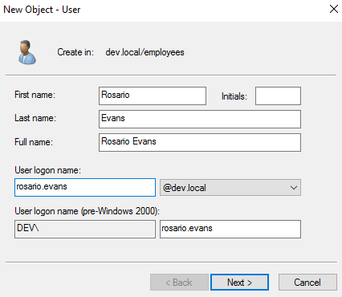
14. Right click each user, go to Properties, and edit their email addresses. Click Apply and then OK. 
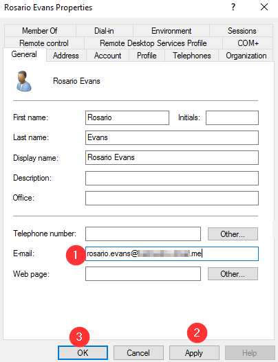

## Install the Active Directory Agent
1. On your Windows Server, log into the Okta Admin Dashbord.
2. Go to Directory > Directory Integrations
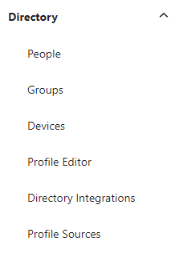
3. Click the "Add Active Directory" button. Follow the instructions to download and install the Active Directory Agent. Use the Active Directory Super Administrator account when asked to log into the agent. 
4. Once the agent install is complete, finish the rest of the integration setup. Go to Directory > Directory Integrations and select your new domain.
5. Sync Users and Groups from the Employees OU. Set users to log in with their email addresses.
6. Go through the rest of the prompts.
7. Go to the "Provisioning" tab. Under the General settings, schedule user imports for every hour, set the Okta username format to email address, and check the JIT provisioning checkbox.
8. On the next page go to the Import tab and run a full import. Click the "Import Now" button. 
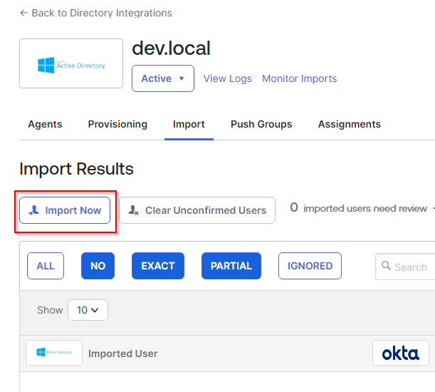
8. Confirm the user assignments and auto-activate the users.
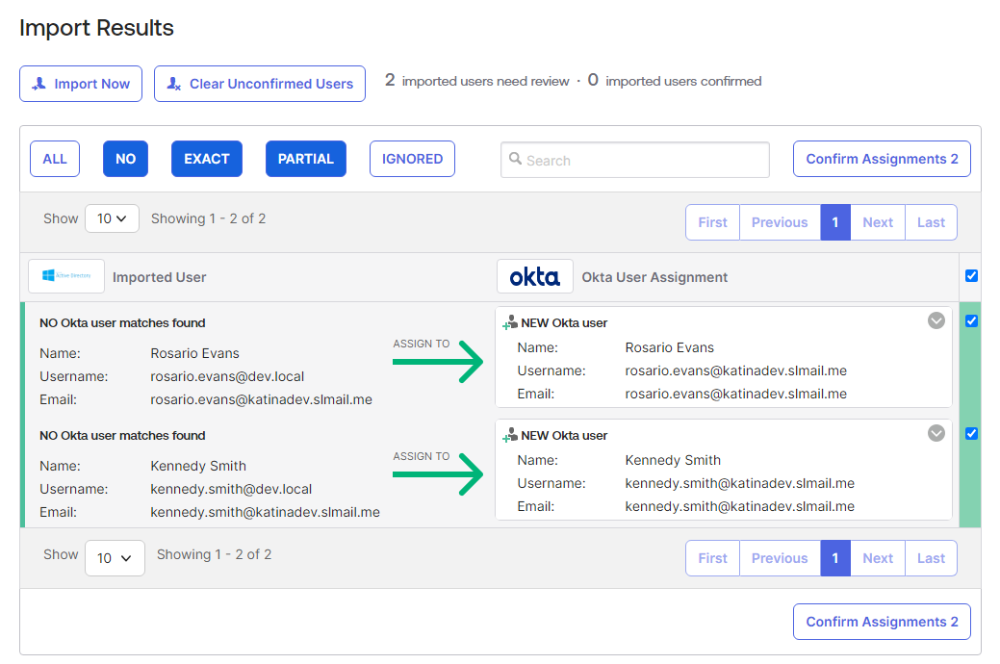
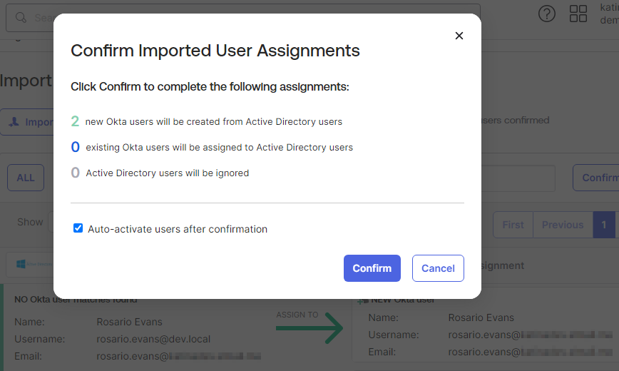

# BambooHR Initial User Setup
- BambooHR offers a free trial you can sign up for [here](https://www.bamboohr.com/signup/b4)
- You can enter dummy data for the free trial form. 
- When you are able to log into your trial tenant, in the upper right corner, select the option to clear the tenant test data.
- Create new users in BambooHR based on the table above. DO NOT create Leon yet. Birthdates don't matter. You can set the Hire Date to the day you are doing the lab. Allow the user to log into BambooHR. 
- Create another employee with the initial email address for your default super admin account. 
- On the user page that appears click the Gear Icon and set the Access Level to Full Admin.
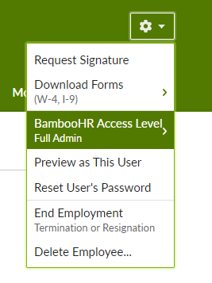

# Connect BambooHR and Okta
For reference see [Integrate BambooHR with Okta](https://help.okta.com/en-us/content/topics/provisioning/bamboohr/bamboohr-integrate.htm)

BambooHR is part of the Okta Integration Network and is integrated via SAML. 

1. In the lefthand menu, go to Applications > Applications
2. Click "Browse App Catalog"
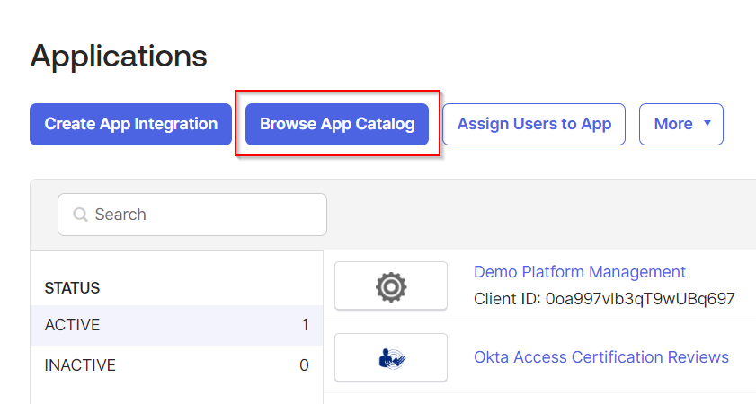
3. Search for the BambooHR connection and add the integration.
4. Go through the wizard and fill in your subdomain.
5. Select SAML 2.0 as your sign-on method 
6. View and follow the SAML 2.0 setup instructions.
7. In your BambooHR settings, for this lab, to avoid getting accidentally locked out check the "Allow optional email and password login" checkbox. 
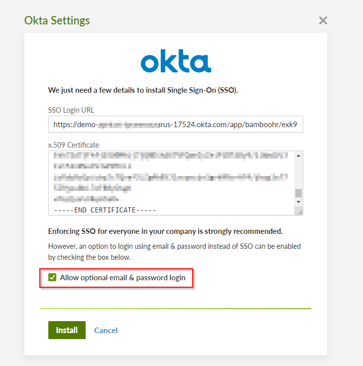
8. Back in Okta, set the Saml Name ID as email. Save the connection. 
9. In the Okta settings for BambooHR, go to the Provisioning tab and click the "Configure API Integration" button. 
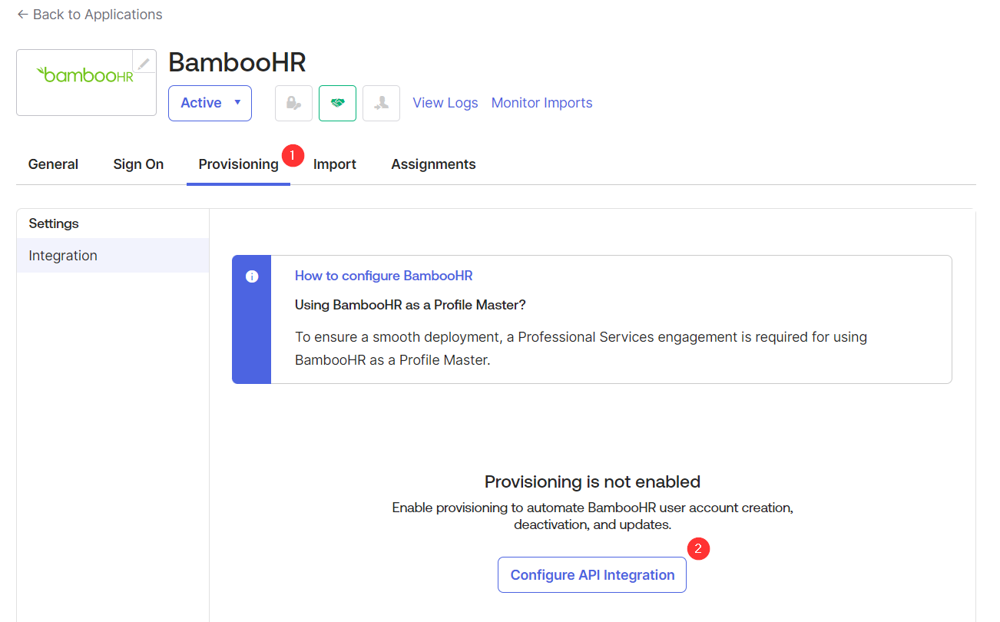
10. Check the "Enable API Integration Checkbox" and the "Authenticate with BambooHR" button. If prompted for credentials, use the super admin user that was initially created with your BambooHR tenant. 
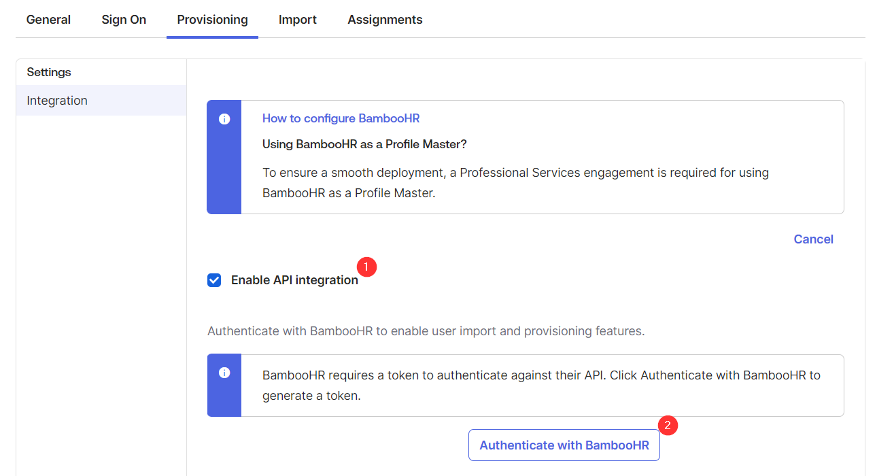
11. The settings in the provisioning tab will update. Under the Provisioning settings, go to "To Okta". 
12. Schedule imports for every hour. 
13. Scroll down and check the "Allow BambooHR to source Okta users" checkbox.  Keep the default settings.
14. Under the "To App" settings, check the "Update User Attributes" checkbox.
15. Go to the Import tab and click "Import Now". 
16. Approve Rosario, Kennedy, and your administrator user as Okta user matches by checking the checkboxes on the righthand side and clicking the "Confirm Assignments" button.
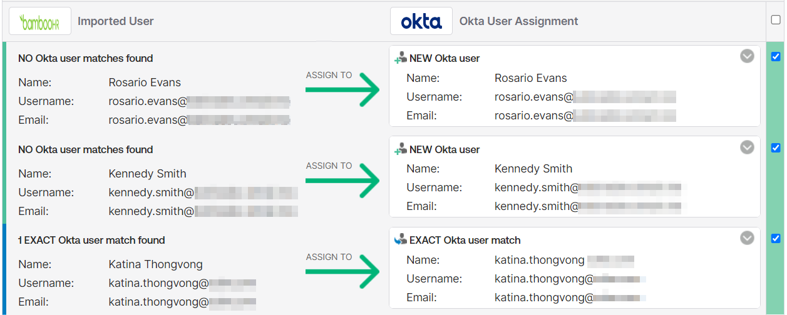
14. Confirm the users and auto-activate the users after confirmation. 

## Import users from Active Directory and test the login
1. In the lefthand menu go to Directory > Directory Integrations. 
2. Select your Active Directory integration.
4. In an icognito window, visit your Okta tenant url and attempt to log in as kennedy.smith using the password you set in Active Directory. The password should work and you will be prompted to configure MFA.
5. When you log in as kennedy.smith (or kennedy.smith@youremaildomain.com), BambooHR will appear on the Okta user dashboard. Attempt to log into BambooHR by clicking the BambooHR icon. 
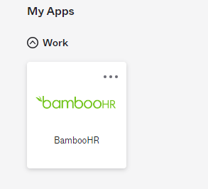
6. The BambooHR login should be successful. 
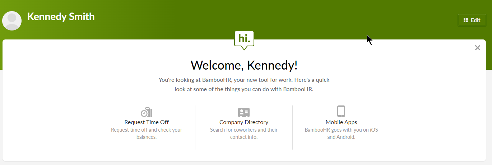
7. Run another test by logging in as Rosario Evans
## Configure provisioning to Active Directory
1. Back in the Active Directory integration settings, open the Provisioning tab. 
2. In the Provisioning settings, go to "To App."
3. Enable the "Create Users" checkbox.

## Configure the attribute source for a user's email
1. Go to Directory > Profile Editor. 
2. Select the default user profile. 
3. In the profile editor, scroll down and click the "i" icon to edit the email attribute. 
4. Change the source priority to "Override profile source" and select Active Directory as the profile source. Make the attribute read-only in Okta.

## Change the email address for the user in Active Directory and test the login
1. In your Windows Server, go to Tools > Active Directory Users and Computers
2. Edit the properties for Rosario Evans. Change his email from rosario.evans@youremaildomain.com to rosario@youremaildomain.com
3. Now, when you log into your Okta tenant, you would use `rosario` as your username and NOT `rosario.evans`.
4. When you log in as Rosario and you access the user settings from the upper righthand corner, you can see that the email address changed from rosario.evans@youremaildomain.com to rosario@youremaildomain.com
5. If you log into BambooHR as Rosario, and look at the user info under "My Info" you will see that the email address has also changed in BambooHR. 